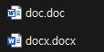
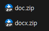

# 1주차 과제

## 1. 과제 목표
- #### MS-Word 문서 버전별 특성 조사 및 구조 분석

## 2. 분석

### 2-1. 버전별 특징 및 차이점
- doc 파일
  - OLE(Object Linking Embedding) 파일 구조를 사용
  - "Binary File Format"이라고 불리며, 이진 형식으로 저장
  - docx보다 큰 파일 크기를 가짐
- docx 파일
  - Open XML 파일 형식을 기반으로, XML 및 ZIP압축을 사용하여 문서 내용을 저장
  - 압축을 사용하여 작은 크기를 가짐
  

### 2-2. MS-Word 문서 구조의 이해

- ###  포맷 추출 과정 
    먼저 doc파일과 docx파일을 각각 저장한다.
  
    

    그 후 파일의 확장자를 .zip으로 바꿔준다.
    
    

    압축을 풀면 된다.

- ###  바이너리 파일 형식(.doc) 
  
    doc 파일의 문서 구조이다.

        📦doc
        ┣ 📜1Table
        ┣ 📜Data
        ┣ 📜WordDocument
        ┣ 📜_CompObj
        ┣ 📜_DocumentSummaryInformation
        ┗ 📜_SummaryInformation

- **1Table / 0Table**
  - FIB(Fixed Information Block)이라는 구조 내의 base.fWhichTblStm 값이 1이면, 1Table을 참조하고, 그렇지 않으면 0Table을 참조한다.
  - 1Table
    - word 문서의 구조와 레이아웃 정보를 담고 있다.
  - 0Table
    - 문서 제목, 작성자, 키워드 및 다른 메타데이터 정보 등 일반적인 문서 정보를 포함한다.

- **Data**
  - Data 스트림은 특정한 구조를 가지지 않고, 주로 문서에서 참조되는 다양한 데이터를 저장하는데 사용된다. 다른 스트림에서 이 스트림을 참조하지 않는다면, 해당 스트림은 사용되지 않는다.

- **WordDocument**
  - Word문서를 식별하는데 필요한 코드를 포함하며, 본문의 내용을 포함하고 있다.

- **_CompObj**
  - MS워드 파일의 버전 정보를 담고 있다.

- **_DocumentSummaryInformation**
  - 문서의 요약 정보를 포함하며, 문서의 카테고리, 페이지 수, 단어 수, 수정한 날짜, 최종 인쇄 날짜 등의 메타데이터가 포함된다.

- **_SummaryInformation**
  - 이 파일에는 문서의 기본 요약 정보가 들어있다. 문서 작성자, 제목, 주제, 키워드 같은 것들이 이곳에 저장된다.

- ###  XML 기반 파일 형식(.docx) 
    
    docx 파일의 문서 구조이다.
    
        📦docx
        ┣ 📂docProps
        ┃ ┣ 📜app.xml
        ┃ ┗ 📜core.xml
        ┣ 📂word
        ┃ ┣ 📂media
        ┃ ┃ ┗ 📜image1.png
        ┃ ┣ 📂theme
        ┃ ┃ ┗ 📜theme1.xml
        ┃ ┣ 📂_rels
        ┃ ┃ ┗ 📜document.xml.rels
        ┃ ┣ 📜document.xml
        ┃ ┣ 📜fontTable.xml
        ┃ ┣ 📜settings.xml
        ┃ ┣ 📜styles.xml
        ┃ ┗ 📜webSettings.xml
        ┣ 📂_rels
        ┃ ┗ 📜.rels
        ┗ 📜[Content_Types].xml

- **app.xml**
  - 파일에는 문서가 생성된 애플리케이션의 이름과 버전, 문서의 페이지 수나 단어 수 같은 애플리케이션 관련 통계 정보가 담겨 있습니다.
- **core.xml**
  - 문서의 핵심 메타데이터를 담고 있으며, 이에는 제목, 주제, 작성자, 생성 날짜 등이 포함된다.
- **document.xml**
  - 문서의 실제 텍스트 컨텐츠를 저장하고 있습니다.
- **_rels**
  - 문서의 패키지 레벨 관계가 정의, 다른 리소스들 사이의 관계를 정의.
- **[Content_Types].xml**
  - 파일은 패키지 내의 파일 타입들을 정의합니다. 문서 내의 각 파일 형식과 해당 파일에 사용되는 MIME 타입을 지정합니다.