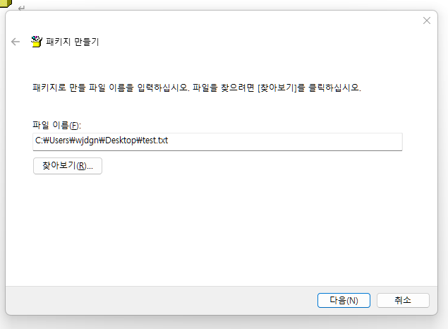

# 5주차 과제

## 1. 과제 목표
1. #### oleobject 삽입 공격이 어떤 것인지 정리하고, 실제로 삽입된 Word 문서를 만들어보기.
2. #### 악성코드 내에 어떤 구조로 oleobject가 삽입되어있는지 확인하기.
3. #### oletools 중에 워드 내에 삽입된 oleobject 파일 명을 출력해주는 오픈소스를 찾고 사용법 확인하기.

## 2. 분석

- ### 2-1. oleobject 삽입공격이란?

  - 먼저 OLE(Object Linking & Embedding)란?

        각각의 프로그램에서 생산한 자료들을 독립적으로 사용하는 것이 아니라, 각각의 자료들을 서로 엮어놓은 것이다.
        즉, 각각의 독립적 자료들을 하나의 응용프로그램에서 다양하게 사용할 수 있는 기능이다.
      
  이러한 OLE객체 삽입을 이용하여 악성 스크립트나 프로그램을 삽입하여, 사용자의 실행을 유도한다.

   

- ### 2-2. OLE OBJECT 삽입한 word문서 만들기

    먼저 삽입할 객체를 생성한다.

    아래의 내용으로 test.txt라는 이름으로 파일을 생성했다.

    

     
    워드파일을 생성한 후, 삽입 -> 개체

    

     
    package 선택

    

     
    파일 선택 후 확인.

    

     
    다음과 같이 아이콘이 생성된다.

    

     
    아이콘을 더블클릭하면 메모장이 열린다.

    

     

- ### 2-3. oleobject 삽입 구조 분석하기

    먼저 일반 doc 파일과 oleobject가 삽입된 doc 파일의 구조는 다음과 같다.

    
    

    위와 같이 ObjectPool 영역이 추가되어있다.

        📜_ObjInfo:
        이 파일은 객체에 대한 정보를 저장한다. 객체의 크기, 유형 및 다른 메타데이터와 관련된 정보가 여기에 저장된다.

        📜_Ole10Native:
        이 파일은 객체의 원시 데이터를 저장한다. 객체가 다른 문서나 파일을 포함하는 경우 해당 원시 데이터가 여기에 저장된다. 이 파일을 통해 해당 객체가 다른 문서와 연결되는 정보를 저장한다.
     
    그리고 일반 docx 파일과 oleobject가 삽입된 docx 파일의 구조는 다음과 같다.

    
    

    위와 같이 embeddings -> oleObject1.bin이 추가되었다.

        📜oleObject1.bin:
        oleObject1.bin 파일은 실제 OLE 객체 데이터를 포함하고 있으며, OLE 객체의 내용을 나타낸다.

   
    
  **[+] 몇가지의 악성 OLE객체 삽입 워드파일의 구조를 확인해 본 결과는 다음과 같다.**

        <doc>
        
        📦2C8C4DFA0DE028153C534F173231E81780F7BDA815F9F4EDA408714418A03E18
        ┣ 📜OJsSHjXtq
        ┗ 📜_Ole10Native

        📦2B9E1A2609E5943E73767A1093ACB809CED5540FBFE2BD5C50ED58025033FFD8
        ┗ 📜_OLE10naTIve

        📦2B9E1A2609E5943E73767A1093ACB809CED5540FBFE2BD5C50ED58025033FFD8
        ┗ 📜_OLE10naTIve
    
    doc 형식의 악성 OLE객체 삽입 워드파일의 경우, _ole10Native 파일만 있는 것도 있을정도로 필수적인 파일이다.
    OLE 객체의 데이터가 저장되어 있는 부분이라 그런 것으로 보인다.

     
        
        <docx>
        
        📦2E6B1EF65EE4AB2C749BA2D9D63F433760EF13F29DAFA6FC125F97CBD1051B79
        ┣ 📂docProps
        ┃ ┣ 📜app.xml
        ┃ ┗ 📜core.xml
        ┣ 📂word
        ┃ ┣ 📂embeddings
        ┃ ┃ ┗ 📜oleObject1.bin

        📦10F3EABFF388DE30BD427402A7568623B4D3F6295DEA62C0D6E744C06F0F65CA
        ┣ 📂docProps
        ┃ ┣ 📜app.xml
        ┃ ┗ 📜core.xml
        ┣ 📂word
        ┃ ┣ 📂embeddings
        ┃ ┃ ┗ 📜oleObject1.bin

    docx 형식의 악성 OLE객체 삽입 워드파일의 경우, oleObject1.bin이 필수로 있는 것을 확인할 수 있었다.
    doc와 마찬가지로 객체의 데이터가 저장되어 있는 부분이기 때문인 것 같다.

 

- ### 2-4. oleobj

    oletools 중 oleobj라는 툴이 있다.

    실행하면 다음과 같이 사용법이 나오는데, 옵션 -i 부분이 추가적인 파일을 분석해주는 기능이다.

    

     

    oleobj의 -i 옵션을 이용하여 위에서 만든 ole.doc를 대상으로 실행시킨다.

    
    

    Filename 부분에 삽입한 파일 이름이 출력되고 실행시킨 경로에 삽입한 txt파일도 추출되는 것을 확인할 수 있었다.