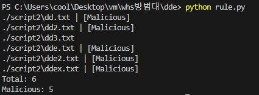

# 6주차 과제

## 1. 과제 목표
1. #### oleobject가 삽입된 악성코드를 분석하고 의심스러운 부분에 대해서 어떻게 탐지를 진행할지 아이디어 작성하기
2. #### oletools 내 도구를 사용하여 DDE 스크립트 추출 / 야라룰작성

<br>

## 2-1. oleobject 악성코드 분석

### 1) oleobj를 활용하여 분석
- oleobject가 삽입된 3개의 악성 워드파일을 추출하여 파일 구조를 확인하였다.

    

    _ObjInfo라는 파일이 모든 파일에 포함되어 있다. 이 파일을 중심으로 살펴보면 될 것 같다.


- oleobj로 악성 워드 파일을 실행해보았다.
  
  

  아래의 oleobject를 직접 삽입한 워드파일의 경우는 `_Ole10Native` 파일이 있어서 객체의 스트림을 추출 할 수 있지만, 위의 악성 워드파일은 `_Ole10Native`가 존재하지 않아서 OLE 객체의 스트림이 추출되지 않는다..
  
  

<br>

### 2) 파일 내용 분석
- olebrowse툴로 파일의 내용을 확인해보았다. (txt파일로 열어도 된다.)
  
  

  

  

  세 악성 문서 파일 모두에서 url이 포함된 파일을 발견했다.
  
  (위에 OCX라는 이름이 많이 보여서 알아보니 OCX(Ole Control eXtention)는 ActiveX 컨트롤로 알려져있는데,
  웹 브라우저 내에서 특정 동작을 수행하는 ActiveX 컨트롤을 사용할 수 있다고한다.)

  아마도 url을 통해 악성 행위를 실행시키는 것으로 예상된다.

  그래서 파일들의 내용을 텍스트로 뽑아 url이 있을경우 악성으로 판단하도록 진행하면 될 것 같다.

<br>

### 3) 파일의 내용을 전부 텍스트로 추출
- 위의 내용에서 알 수 있듯이 url사이가 null값으로 매워져 있었기 때문에 텍스트로 출력 불가능한 문자는 제외하도록 하였다.
  
  ```python
  # doc 파일의 내부 파일들의 내용을 텍스트로 추출하는 프로그램
  # docx는 XML 포맷이기 때문에 다루지 않음

  import olefile
  import os
  import re

  def extract_text_from_ole_doc(file_path, output_dir):    
  if not os.path.exists(output_dir):
        os.makedirs(output_dir)

  base_name = os.path.splitext(os.path.basename(file_path))[0]
  output_txt_file_path = os.path.join(output_dir, base_name + ".txt")

  with olefile.OleFileIO(file_path) as ole:
        all_entries = [entry for entry in ole.listdir()]

        with open(output_txt_file_path, 'w', encoding='utf-8') as output_file:
              for entry in all_entries:
              if ole.exists('/'.join(entry)):
                    stream = ole.openstream(entry)
                    content = stream.read().decode('utf-8', errors='ignore')
                    content_clean = re.sub(r'[\x00-\x1F\x7F-\xFF]', '', content) # 텍스트로 출력 불가능한 문자는 지움
                    output_file.write(content_clean + '\n')

  print(f"{output_txt_file_path}")

  def process_directory(input_dir, output_dir):
  for filename in os.listdir(input_dir):
        file_path = os.path.join(input_dir, filename)
        if os.path.isfile(file_path) and file_path.endswith('.doc'):
              extract_text_from_ole_doc(file_path, output_dir)


  input_dir = './malole'
  output_dir = './malole/script'
  process_directory(input_dir, output_dir)

  ```
  <br>
  실행 결과 다음과 같이 파일의 내용이 텍스트로 잘 추출되었다.

  

  다음 Yara-rule을 이용해 url을 탐지하도록 하면 될 것 같다.

<br>

### 4) Yara-rule 작성 및 rule 기반 탐지

- url 패턴을 탐지하기 위해서 url의 프로토콜 부분을 매칭하도록 rule을 작성하였다.
  ```javascript
  // protocol로 url을 탐지하는 rule
  rule detect_url
  {
    meta:
      description = "Detect url in olefiles"
      author = "WHS 방범대"
      date = "2023-12-20"
    strings: 
      $http = "http://" nocase 
      $https = "https://" nocase
      $ftp = "ftp://" nocase
      $ftps = "ftps://" nocase
      $ssh = "ssh://" nocase
      $telnet = "telnet://" nocase
      $smtp = "smtp://" nocase
      $pop3 = "pop3://" nocase
      $imap = "imap://" nocase
      $sftp = "sftp://" nocase
      $dns = "dns://" nocase
      $rtp = "rtp://" nocase
      $ldap = "ldap://" nocase
      $rtsp = "rtsp://" nocase
      $sip = "sip://" nocase

  condition:  
   any of ($http, $https, $ftp, $ftps, $ssh, $telnet, $smtp, $pop3, $imap, $sftp, $dns, $rtp, $ldap, $rtsp, $sip)
  }


- 작성한 rule을 실행하기 위해 python 코드를 작성하였다.

  ```python
  # url.yara 기반 악성 워드파일을 탐지하는 코드
  import yara
  import os

  dir_path = "./malole/script"
  rules = yara.compile(filepath="./url.yara")

  malicious, total = 0, 0

  for filename in os.listdir(dir_path):
      file_path = os.path.join(dir_path, filename)
      if os.path.isfile(file_path):
          with open(file_path, 'rb') as f:
              total += 1
              matches = rules.match(data=f.read())
              if matches:
                  malicious += 1
                  print(f"{file_path} | [Malicious]")
              else:
                  print(f"{file_path}")

  print(f"Total: {total}")
  print(f"Malicious: {malicious}")
  ```

- 실행결과는 다음과 같다.
  
  

  일단 3개의 악성파일을 탐지하는 데는 성공했다.
  
- 일반 워드파일과 악성이 아닌 oleobject를 삽입한 문서를 추가하여 코드를 실행해 보았다.
  
  

  모두 악성 문서파일로 탐지되어서 캡쳐된 스크립트에서 해당 내용을 찾아보았다.
  
  
  
  두 파일 모두 다음과 같은 url이 포함되어 있었다.

  악성이 아닌 기본 워드 파일에도 포함되어있는 url이기 때문에 위의 `http://schemas.openxmlformats.org`의 도메인을 가진 url은 제외하도록 새로 rule을 추가해준다. 
 
  ```javascript
  // protocol로 url을 탐지하는 룰
  rule detect_url
  {
    meta:
      description = "Detect url in olefiles"
      author = "WHS 방범대"
      date = "2023-12-20"
    strings: 
      $http = "http://" nocase 
      $https = "https://" nocase
      $ftp = "ftp://" nocase
      $ftps = "ftps://" nocase
      $ssh = "ssh://" nocase
      $telnet = "telnet://" nocase
      $smtp = "smtp://" nocase
      $pop3 = "pop3://" nocase
      $imap = "imap://" nocase
      $sftp = "sftp://" nocase
      $dns = "dns://" nocase
      $rtp = "rtp://" nocase
      $ldap = "ldap://" nocase
      $rtsp = "rtsp://" nocase
      $sip = "sip://" nocase

      $excluded_domain = "http://schemas.openxmlformats.org" nocase

  condition:  
  any of ($http, $https, $ftp, $ftps, $ssh, $telnet, $smtp, $pop3, $imap, $sftp, $dns, $rtp, $ldap, $rtsp, $sip) and not $excluded_domain
  }
  ```
  실행결과는 다음과 같이 정상 파일은 제외된 것을 확인하였다.
  
  
<br>

- ### [+] oleobj 툴을 디렉터리 단위로 실행시키기 위한 파이썬 코드.
  
    ```python
    import os
    import subprocess

    directory = "./malole"

    # 디렉토리 순회
    for filename in os.listdir(directory):
        if filename.endswith(".doc") or filename.endswith(".docx"):
            filepath = os.path.join(directory, filename)
            print(f"Processing: {filepath}")

            # oleobj 명령어 실행
            result = subprocess.run(["oleobj", "-i", filepath], capture_output=True, text=True)

            # 결과 출력
            print(result.stdout)
            if result.stderr:
                print("Error:", result.stderr)

    print("OLE extraction complete.")
    ```


<br>

## 2-2. DDE 문서 분석

### 1) DDE 스크립트 삽입 문서 생성하기
  1. 삽입 -> 빠른 문서 요소 -> 필드
   
        

  2. = (Formula) 선택 후 확인
        

  3. 필드 코드 토글

        

  4. 스크립트 입력
   
        

  5. 실행 후 예 클릭
   
        

        계산기가 실행이 안된다.
        
        (원래는 계산기가 실행이 되어야 하는데 word에서 DDE관련 패치를 한 것 같다.)

        하지만 일단 진행한다.
<br>

### 2) msodde
  
  - oletools내의 툴로, DDE 스크립트를 파싱해준다.
  - msodde 툴의 -d 옵션을 사용하면 DDE와 DDEAUTO fields의 내용을 리턴해준다.
  
  - 다음은 msodde로 위에서 만든 문서를 파싱한 화면이다.
  
    
    

    문제는 똑같은 DDE가 있는 docx와 doc를 실행했을때 doc파일의 dde는 나오지 않는다. -> 그래서 직접 파일에서 dde의 내용을 가져오기로 해봤다.
    
<br>

### 3) dde 추출하기

  - 위에서 한 것과 같이 파일의 모든 텍스트를 하나의 txt파일에 저장하도록 했다. / dde가 어느 파일에 저장되어있는지 확인하기위해 파일명도 출력하도록 했다.

    

    

    위는 doc 추출내용이고, 아래는 docx이다. dde-link가 추출되었고 docx도 보기엔 지저분하지만 내용은 포함되어 있다.

  - doc는 WordDocument라는 파일에 dde-link가 존재하고, docx는 Word/document.xml에 존재한다. 따라서 doc는 wordDocument, docx는 word/document.xml만 읽어서 텍스트로 저장하는 코드를 작성한다. 
    - 물론 텍스트 사이의 null값이나 쓸데없는 문자는 지우고, docx의 태그도 지워서 dde를 읽기 쉽게 한다.

    ```python
    # doc는 WordDocument, docx파일은 word/document.xml 파일의 내용을 텍스트로 읽어서 txt파일에 저장하는 코드
    import olefile
    import zipfile
    import os
    import re
    from xml.etree import ElementTree as ET

    def extract_text_from_docx(file_path, output_file):
        with zipfile.ZipFile(file_path, 'r') as zip_ref:
            if 'word/document.xml' in zip_ref.namelist():
                with zip_ref.open('word/document.xml') as xml_file:
                    tree = ET.parse(xml_file)
                    root = tree.getroot()
                    texts = [node.text for node in root.iter() if node.text]
                    content = ''.join(texts)

                    output_file.write(f"{content}\n")


    def extract_text_from_ole_doc(file_path, output_file):
        with olefile.OleFileIO(file_path) as ole:
            if ole.exists('WordDocument'):
                stream = ole.openstream('WordDocument')
                content = stream.read().decode('utf-8', errors='ignore')
                content_clean = re.sub(r'[\x00-\x1F\x7F-\xFF]', '', content)
                output_file.write(f"{content_clean}\n")

    def process_file(file_path, output_dir):
        base_name = os.path.splitext(os.path.basename(file_path))[0]
        output_txt_file_path = os.path.join(output_dir, base_name + ".txt")

        with open(output_txt_file_path, 'w', encoding='utf-8') as output_file:
            if file_path.endswith('.doc'):
                extract_text_from_ole_doc(file_path, output_file)
            elif file_path.endswith('.docx'):
                extract_text_from_docx(file_path, output_file)

        print(f"File saved to {output_txt_file_path}")

    def process_directory(input_dir, output_dir):
        if not os.path.exists(output_dir):
            os.makedirs(output_dir)

        for filename in os.listdir(input_dir):
            file_path = os.path.join(input_dir, filename)
            if os.path.isfile(file_path) and (file_path.endswith('.doc') or file_path.endswith('.docx')):
                process_file(file_path, output_dir)

    input_dir = '.' 
    output_dir = './script2'
    process_directory(input_dir, output_dir)
    ```

  - 다음은 실행 결과이다. (캡쳐를 위해 파일 내용을 임의로 줄바꿈 하였다.)

    

    

    깔끔하게 출력된 것을 확인할 수 있다.

<br>

### 4) Yara-rule 작성 및 rule 기반 탐지

  - 탐지 rule에 대해서는 조금 더 생각을 해봐야겠지만 일단은 'DDEAUTO' 라는 문자가 포함되어 있으면 탐지하도록 작성했다.


    ```javascript
    // DDEAUTO를 탐지하는 rule
    rule detect_url
    {
      meta:
        description = "Detect DDEAUTO"
        author = "WHS 방범대"
        date = "2023-12-22"
      strings: 
        $ddeauto = "DDEAUTO" nocase 


    condition:  
      any of ($ddeauto)
    }
    ```

    ```python 
    # url.yara 기반 악성 워드파일을 탐지하는 코드
    import yara
    import os

    dir_path = "./script2"
    rules = yara.compile(filepath="./dde.yara")

    malicious, total = 0, 0

    for filename in os.listdir(dir_path):
        file_path = os.path.join(dir_path, filename)
        if os.path.isfile(file_path):
            with open(file_path, 'rb') as f:
                total += 1
                matches = rules.match(data=f.read())
                if matches:
                    malicious += 1
                    print(f"{file_path} | [Malicious]")
                else:
                    print(f"{file_path}")

    print(f"Total: {total}")
    print(f"Malicious: {malicious}")
    ```

  - 실행 결과는 다음과 같다
    