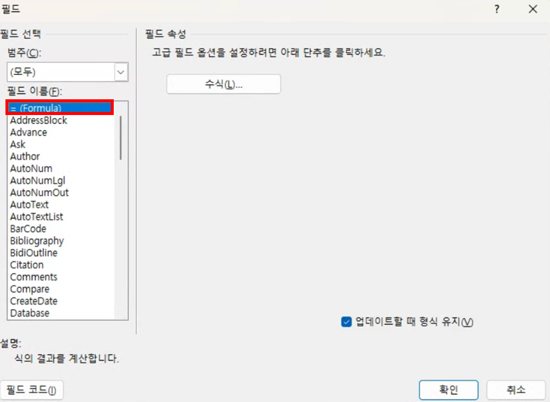

# 6주차 과제

## 1. 과제 목표
1. #### oleobject가 삽입된 악성코드를 분석하고 의심스러운 부분에 대해서 어떻게 탐지를 진행할지 아이디어 작성하기
2. #### oletools 내 도구를 사용하여 DDE 스크립트 추출 / 야라룰작성

## 2-1. oleobject 악성코드 분석

- oleobject가 삽입된 3개의 악성 워드파일을 추출하여 파일 구조를 확인하였다.

    

    _ObjInfo라는 파일이 모든 파일에 포함되어 있다. 이 파일을 중심으로 살펴보면 될 것 같다.


- oleobj로 악성 워드 파일을 실행해보았다.
  
  

  아래의 oleobject를 직접 삽입한 워드파일의 경우는 `_Ole10Native` 파일이 있어서 객체의 스트림을 추출 할 수 있지만, 위의 악성 워드파일은 `_Ole10Native`가 존재하지 않아서 OLE 객체의 스트림이 추출되지 않는다..
  
  


- ### [+] oleobj 툴을 디렉터리 단위로 실행시키기 위한 파이썬 코드.
  
    ```python
    import os
    import subprocess

    directory = "./malole"

    # 디렉토리 순회
    for filename in os.listdir(directory):
        if filename.endswith(".doc") or filename.endswith(".docx"):
            filepath = os.path.join(directory, filename)
            print(f"Processing: {filepath}")

            # oleobj 명령어 실행
            result = subprocess.run(["oleobj", "-i", filepath], capture_output=True, text=True)

            # 결과 출력
            print(result.stdout)
            if result.stderr:
                print("Error:", result.stderr)

    print("OLE extraction complete.")
    ```


## 2-2. DDE 문서 분석

- ### 먼저 DDE 스크립트을 삽입한 문서를 직접 생성해본다.
  1. 삽입 -> 빠른 문서 요소 -> 필드
   
        

  2. = (Formula) 선택 후 확인
        

  3. 필드 코드 토글

        

  4. 스크립트 입력
   
        

  5. 실행 후 예 클릭
   
        

        계산기가 실행이 안된다. 뭔가 문제가 있는 것 같다


- ### msodde
  
  - oletools내의 툴로 DDE 스크립트를 파싱해준다. 아직 사용은 안해봄.

        


